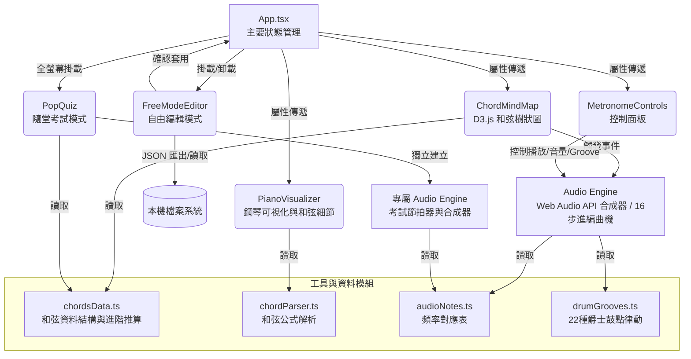

# 互動式樂理和弦進行心智圖

**D3.js 樂理解析版**
*基於屬七和弦 (Dominant 7th) 與主音 (Tonic) 解決關係的無限遞迴樂理視覺化演繹。*

---

## 📖 專案簡介

這是一個純前端的單頁應用程式，透過 D3.js 動態渲染和弦分支結構，讓學習者能直觀地探索與試聽和弦進行（Chord Progressions）。系統內建 Web Audio API 硬體加速的高品質合成器與節拍器，並支援「自訂自由編輯模式」與「隨堂考試模式」，全方位強化和弦認知與彈奏記憶。

---

## 🏗 架構圖 (Architecture Diagram)



---

## 📂 專案結構

```text
C:\USERS\USER\DESKTOP\ANTIGRAVITY\CHORD-TREE-METRONOME\
│  index.html
│  package.json
│  vite.config.ts
│
└─src\
    │  App.tsx
    │  chordsData.ts
    │  chordTreeData.ts
    │  index.css
    │  main.tsx
    │  types.ts
    │
    ├─components\
    │      ChordMindMap.tsx
    │      ChordMindMapB.tsx
    │      ChordTreeSvg.tsx
    │      CustomProgressionFlow.tsx
    │      FreeModeEditor.tsx
    │      InteractiveGuides.tsx
    │      MetronomeControls.tsx
    │      PianoVisualizer.tsx
    │      PopQuiz.tsx
    │      TooltipProvider.tsx
    │
    └─utils\
            audioEngine.ts
            audioNotes.ts
            chordParser.ts
            drumGrooves.ts
```

---

## 🚀 使用說明

1. **基本操作**：
   - 使用滑鼠拖曳或觸控可移動 D3.js 樹狀圖視角，滾輪可放大縮小。
   - 單擊任一和弦節點即可即時試聽和弦。
   - 雙擊和弦節點可摺疊或展開該節點底下的所有分支。
2. **和弦分支表分類切換**：
   - 主畫面提供「原始心智圖」、「對稱放射版」與「橫向圓框版」三種視覺化模式供使用者選擇。
3. **播放與節拍器控制**：
   - 點擊「開始/停止」依序播放當前的路徑軌跡。
   - 支援自由調整 BPM (30 - 300)。
   - 提供多種音色（合成器 Pad、電鋼琴、柔和 Strings）與播放模式（和弦齊奏、琶音）。
   - 提供 22 種現代 Drum Groove (鼓組律動)，涵蓋四拍直踏、後拍律動、搖擺律動、放克切分音與拉丁複節奏等 5 大類別，透過 Web Audio API 純手工合成出大鼓、小鼓與雙鈸音效。
4. **自由編輯模式**：
   - 點擊「自由編輯模式」進入自訂和弦進行編輯器。
   - 支援即時加入、於指定位置插入新和弦、刪除、拖曳排序各式和弦（大調、小調、屬七、增減等...）。
   - **JSON 讀取與儲存**：可將自己精心設計的進行軌跡儲存到本機的 JSON 檔案中，或隨時讀取回來。
5. **隨堂考試模式 (NEW)**：
   - 點擊「隨堂考試」按鈕，進入全螢幕動態和弦測驗。
   - 系統會在每小節 4 拍自動切換隨機和弦（支援 34 種常見與進階和弦）。
   - 顯示上一個、目前、下一個和弦，並附帶隱藏式的鋼琴鍵盤解答提示。
6. **鋼琴可視化**：
   - 面板下方會同步顯示當前播放和弦在鋼琴鍵盤上的具體按壓位置、和弦組成音與樂理公式。

---

## 📅 更新歷史 (Date Sorted)

- **2026-07-07**: 初始化專案 `互動式樂理和弦進行心智圖`。完成 D3.js 遞迴視覺化、Web Audio 引擎整合、鋼琴鍵盤可視化、以及自由編輯模式的 JSON 本機儲存/讀取功能。
- **2026-07-08**: 修正直式與橫式手機與平板介面重疊、破版與超出邊界的問題，完整自適應所有行動裝置與瀏覽器 (Brave, Safari, Edge, Chrome, Firefox 等)。
- **2026-07-09**: 節拍器核心引擎全面升級為 16-Step Sequencer，並實作 Web Audio API 鼓組合成引擎，新增 22 種現代伴奏鼓點律動 (Drum Groove) 以及完整的說明互動視窗。
- **2026-07-09**: 新增「隨堂考試」全螢幕測驗功能與 34 種進階和弦推算支援 (maj7, m7b5, dim, aug, m(maj7) 等)。
- **2026-07-10**: 優化「隨堂考試」手機橫式排版，加入控制按鈕懸停提示。擴增 9 種全新節奏型態 (如 EDM, Heavy Metal, Soft Swing, Trance 等)，並深度改寫 Audio Engine，使不同節奏具備專屬合成音色 (如拉丁節奏之 Conga/沙鈴、Soft Swing 之鼓刷、EDM/Heavy Metal 之專屬大鼓與破音小鼓)。
- **2026-07-10**: 再度優化手機橫向排版，解決打開鋼琴提示時超出畫面的高度問題；新增 `Rap` 節奏並分類於切分音律動中；將節拍器 BPM 極限範圍擴展為 30 至 300；為各介面所有按鈕新增懸停提示說明 (Tooltip)。
- **2026-07-11**: 新增和弦分支表分類切換功能，可無縫切換「原始心智圖」、「對稱放射版」(基於全新 D3.js 邏輯) 與「橫向圓框版」；並全面重構自訂 React Tooltip 以確保所有觸控裝置的懸停提示都能完美觸發；修正各個下拉選單的對比度與隨堂考試橫向排版。
- **2026-07-12**: 重新設計與實作對稱放射版 (Variant B) 和弦樹狀圖資料結構，導入複雜的方位狀態機 (N, E, S, W...) 與和弦進行推算邏輯，大幅增加衍生分支的多樣性與豐富度；並微調層數切換按鈕等介面提示文字。
- **2026-07-12**: 修正和弦路徑生成邏輯，移除額外添加的不必要和弦，確保各層級生成的步數完美對應層數；並修復「自訂和弦表」按鈕在小螢幕時被遮擋的問題，全面採用自適應排列。
- **2026-07-12**: 修復「原始心智圖 (和弦分支表A)」在不同層數下皆只會跑五個和弦的 Bug，解除深度鎖定以完美對應所選層級；並進一步優化手機與平板橫式瀏覽佈局，將變異切換按鈕區塊加上橫向捲動軸，徹底解決按鈕被擠出區塊而遭遮擋的問題。
- **2026-07-12**: 修正「對稱放射版 (和弦分支表B)」的路徑生成邏輯，使隨機序列產生器在遍歷時自動略過「屬七過渡節點 (dominant)」，確保最終產出的和弦步數能完美對齊使用者指定的層級數量（例如 11 層即產生 11 個目標和弦），並在畫布渲染層加入智慧判斷，讓略過的屬七節點其連線仍能維持視覺發光效果，以符合原設計之對稱美感。
- **2026-07-12**: 修正「隨堂考試」在電腦螢幕上的橫向排版縮放問題，完美對齊左右卡片與鋼琴鍵盤的高度；並在「自由編輯模式」中新增「於指定位置插入新和弦」功能，大幅提升自訂和弦軌跡的編輯效率。
- **2026-07-13**: 優化手機版介面，解決手機橫向瀏覽時「鋼琴鍵盤提示」覆蓋「當前和弦」的重疊問題（新增分層摺疊開闔功能）、縮小左上方副標以避免擋住「自訂和弦表」按鈕，並微調「隨堂考試」直式佈局確保下方鍵盤完全可見。
- **2026-07-14**: 進一步縮小手機與平板橫式瀏覽時左上方的副標題字體至 1/2，解決「自訂和弦表」按鈕被推到區塊外無法顯示的問題。
- **2026-07-14**: 修復「隨堂考試」手機橫式瀏覽時，開啟鋼琴鍵盤提示造成畫面裁切與超出的問題，重新編排為類似平板之左右分欄佈局（左方顯示和弦細節、右方顯示鋼琴鍵盤），並全面將按鈕移至空白處，避免遮擋中央考試用主和弦。
- **2026-07-15**: 將手機版橫式的排版方式延伸應用至所有平板橫式瀏覽，修正「隨堂考試」在大尺寸橫向螢幕上因高度受限而導致的字體重疊遮擋問題，確保主考試和弦隨時保持清晰不被截斷。
- **2026-07-15**: 放大並調整「隨堂考試」於平版橫式瀏覽時，右上角控制區塊(開始/節奏/BPM/顯示鋼琴提示)的排版大小與位置，使其字體放大 2 倍並向下貼齊鋼琴鍵盤可視化區域頂端，進一步改善操作體驗。
- **2026-07-15**: 修正手機直式瀏覽「自由編輯模式」時「新增和弦」按鈕的排版位置，確保其排列於和弦清單最下方；優化手機橫式瀏覽「隨堂考試」介面，縮小當前和弦與鍵盤可視化比例，將控制區塊定錨至右上角，確保完全顯露；統一「和弦分支圖」主標題字體大小並向左貼齊音符 Logo，並將較長之副標題移至「互動指南」內，使整體手機橫向版面更加簡潔無遮擋。
- **2026-07-16**: 針對「隨堂考試」的手機與平板橫式瀏覽排版進行分離與優化，修正手機橫式右側面板過大超出畫面的問題，並將其向下延伸貼齊鍵盤區域，同時將平板橫式的控制面板等比例放大並貼底，確保兩種裝置上的版面皆完美適應且不受彼此影響。
- **2026-07-16**: 徹底修復「隨堂考試」手機橫式瀏覽中控制面板仍會截斷的問題，將面板等比例縮小為約一半大小，並移除主內容區隱藏溢出的限制，允許面板完美重疊至鍵盤可視化上方，保證所有內容皆完整顯露。
