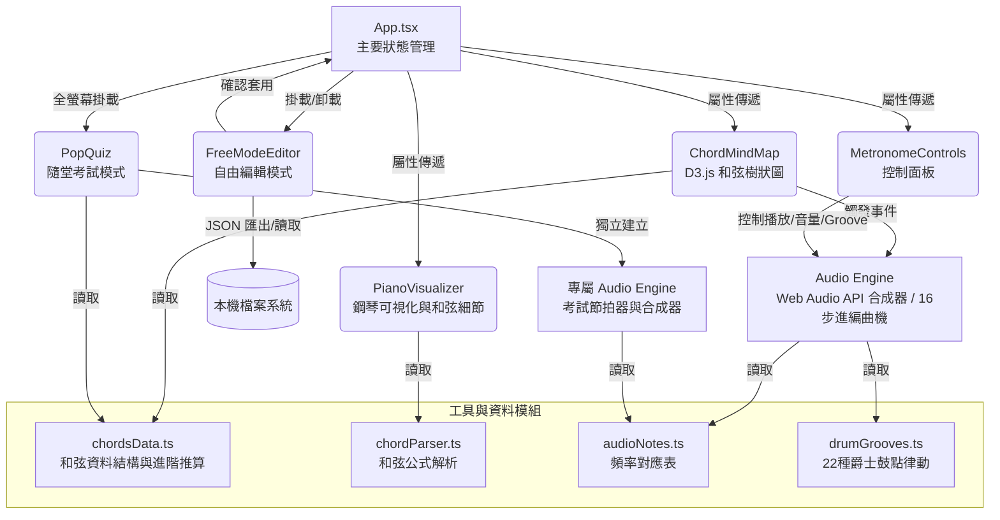

# 互動式樂理和弦進行心智圖

**D3.js 樂理解析版**
*基於屬七和弦 (Dominant 7th) 與主音 (Tonic) 解決關係的無限遞迴樂理視覺化演繹。*

---

## 📖 專案簡介

這是一個純前端的單頁應用程式，透過 D3.js 動態渲染和弦分支結構，讓學習者能直觀地探索與試聽和弦進行（Chord Progressions）。系統內建 Web Audio API 硬體加速的高品質合成器與節拍器，並支援「自訂自由編輯模式」與「隨堂考試模式」，全方位強化和弦認知與彈奏記憶。

---

## 🏗 架構圖 (Architecture Diagram)



---

## 📂 專案結構

```text
C:\USERS\USER\DESKTOP\ANTIGRAVITY\CHORD-TREE-METRONOME\
│  index.html
│  package.json
│  vite.config.ts
│
└─src\
    │  App.tsx
    │  chordsData.ts
    │  chordTreeData.ts
    │  index.css
    │  main.tsx
    │  types.ts
    │
    ├─components\
    │      ChordMindMap.tsx
    │      ChordTreeSvg.tsx
    │      CustomProgressionFlow.tsx
    │      FreeModeEditor.tsx
    │      InteractiveGuides.tsx
    │      MetronomeControls.tsx
    │      PianoVisualizer.tsx
    │      PopQuiz.tsx
    │
    └─utils\
            audioEngine.ts
            audioNotes.ts
            chordParser.ts
            drumGrooves.ts
```

---

## 🚀 使用說明

1. **基本操作**：
   - 使用滑鼠拖曳或觸控可移動 D3.js 樹狀圖視角，滾輪可放大縮小。
   - 單擊任一和弦節點即可即時試聽和弦。
   - 雙擊和弦節點可摺疊或展開該節點底下的所有分支。
2. **播放與節拍器控制**：
   - 點擊「開始/停止」依序播放當前的路徑軌跡。
   - 支援自由調整 BPM (40 - 168)。
   - 提供多種音色（合成器 Pad、電鋼琴、柔和 Strings）與播放模式（和弦齊奏、琶音）。
   - 提供 22 種現代 Drum Groove (鼓組律動)，涵蓋四拍直踏、後拍律動、搖擺律動、放克切分音與拉丁複節奏等 5 大類別，透過 Web Audio API 純手工合成出大鼓、小鼓與雙鈸音效。
3. **自由編輯模式**：
   - 點擊「自由編輯模式」進入自訂和弦進行編輯器。
   - 支援即時加入、刪除、拖曳排序各式和弦（大調、小調、屬七、增減等...）。
   - **JSON 讀取與儲存**：可將自己精心設計的進行軌跡儲存到本機的 JSON 檔案中，或隨時讀取回來。
4. **隨堂考試模式 (NEW)**：
   - 點擊「隨堂考試」按鈕，進入全螢幕動態和弦測驗。
   - 系統會在每小節 4 拍自動切換隨機和弦（支援 34 種常見與進階和弦）。
   - 顯示上一個、目前、下一個和弦，並附帶隱藏式的鋼琴鍵盤解答提示。
5. **鋼琴可視化**：
   - 面板下方會同步顯示當前播放和弦在鋼琴鍵盤上的具體按壓位置、和弦組成音與樂理公式。

---

## 📅 更新歷史 (Date Sorted)

- **2026-07-07**: 初始化專案 `互動式樂理和弦進行心智圖`。完成 D3.js 遞迴視覺化、Web Audio 引擎整合、鋼琴鍵盤可視化、以及自由編輯模式的 JSON 本機儲存/讀取功能。
- **2026-07-08**: 修正直式與橫式手機與平板介面重疊、破版與超出邊界的問題，完整自適應所有行動裝置與瀏覽器 (Brave, Safari, Edge, Chrome, Firefox 等)。
- **2026-07-09**: 節拍器核心引擎全面升級為 16-Step Sequencer，並實作 Web Audio API 鼓組合成引擎，新增 22 種現代伴奏鼓點律動 (Drum Groove) 以及完整的說明互動視窗。
- **2026-07-09**: 新增「隨堂考試」全螢幕測驗功能與 34 種進階和弦推算支援 (maj7, m7b5, dim, aug, m(maj7) 等)。
- **2026-07-10**: 優化「隨堂考試」手機橫式排版，加入控制按鈕懸停提示。擴增 9 種全新節奏型態 (如 EDM, Heavy Metal, Soft Swing, Trance 等)，並深度改寫 Audio Engine，使不同節奏具備專屬合成音色 (如拉丁節奏之 Conga/沙鈴、Soft Swing 之鼓刷、EDM/Heavy Metal 之專屬大鼓與破音小鼓)。
- **2026-07-10**: 再度優化手機橫向排版，解決打開鋼琴提示時超出畫面的高度問題；新增 `Rap` 節奏並分類於切分音律動中；將節拍器 BPM 極限範圍擴展為 30 至 300；為各介面所有按鈕新增懸停提示說明 (Tooltip)。
